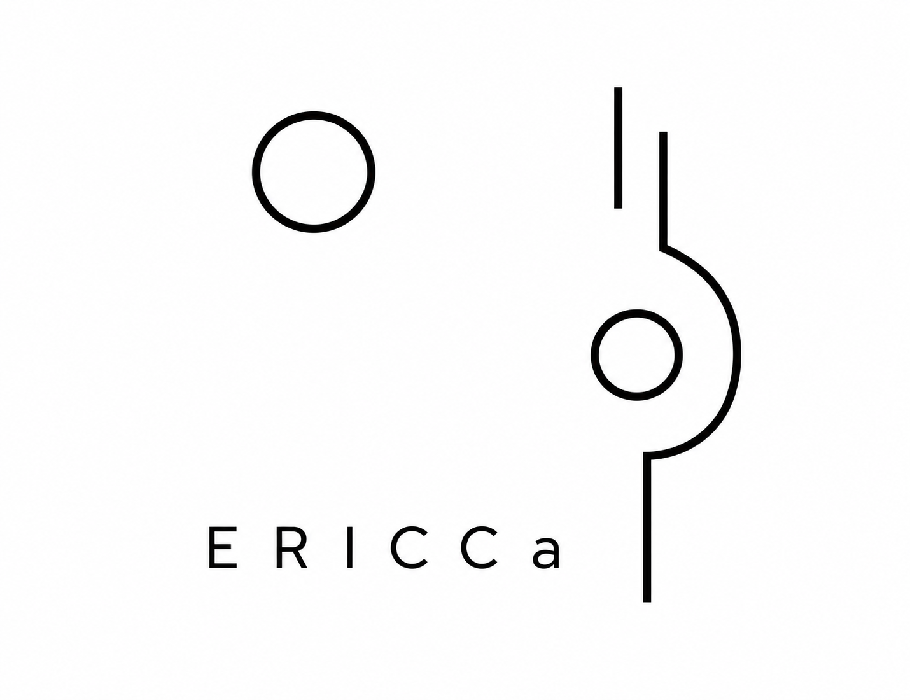

<p align="center">
 
</p>

# Eikonal Reaction, density Input, Cross section Calculator (ERICCa)

A reaction code that calculates nucleus-nucleus reaction cross section in the eikonal framework using nuclear densities as inputs.

## quick start
```
 pip install ERICCa
```
The release versions of the package are hosted at [INSERT]

## Tutorials

Tutorials live in /Tutorials/ERICCa_Tutorial.ipynb

For the full tutorial use /Tutorials/ERICCa_Tutorial.ipynb
If Tutorials is too long use /Tutorials/ERICCa_TLDR.ipynb

## description

**ERICCa** (Eikonal Reaction, density Input, Cross section Calculator) is a Python package for calculating nucleus-nucleus reaction cross sections within the eikonal approximation framework. The code provides a flexible and robust approach to computing reaction observables by taking nuclear density distributions as direct inputs, allowing for accurate modeling of a wide range of nuclear reactions.

### Key Features

- **Eikonal Framework**: Employs the two-body eikonal framework for fast computation of reaction cross sections
- **Density-Based Approach**:nuclear density distributions (matter or proton, and neutron densities) as inputs
- **Accurate Integration**: Implements multi-dimensional numerical integration with adaptive mesh configurations
- **Validated Results**: Benchmarked against experimental reaction data

### Capabilities

ERICCa can calculate:
- Reaction cross sections using matter densities and proton and neutron densities as inputs and a profile function
- Automatic density generation based on rms matter radius and mass number
- Built-in profile functions for Energies 40-1000 MeV
The package is designed for experimental nuclear physicists

## contributing, developing, and testing

## citation
```latex
@software{Smith_AJ_ERICCa_2026,
author = {A. J. Smith, K. Godbey, C. Hebborn, F. M. Nunes},
license = {?},
month = May,
title = {{ERICCa}},
url = {?},
version = {1.0.0},
year = {2026}
}
```
